# Business Case

Sam Samson and Sons is a real estate developer looking to adopt a data driven approach to choosing which properties to acquire, remodel, and bring back to market. In particular they want to answer the following questions:

1. Which upgrades will yield the highest return?
   - Examples:
     - what is the value of adding living space to the home?
     - what is the value of adding a bedroom or a bathroom?

# The Data

The data for this analysis was given to us by the client.  The dataset contains approximately one year of sales data from 05/02/2014, 05/27/2015.

## Column Names and descriptions for Kings County Data Set

**Updated from [https://www.kaggle.com/harlfoxem/housesalesprediction/discussion/207885]**
* **id** - unique identified for a house
* **dateDate** - house was sold
* **pricePrice** -  is prediction target
* **bedroomsNumber** -  of Bedrooms/House
* **bathroomsNumber** -  of bathrooms/bedrooms
* **sqft_livingsquare** -  footage of the home
* **sqft_lotsquare** -  footage of the lot
* **floorsTotal** -  floors (levels) in house
* **waterfront** - House which has a view to a waterfront
* **view** - An index from 0 to 4 of how good the view of the property was
* **condition** - How good the condition is ( Overall )
* **grade** - An index from 1 to 13, where 1-3 falls short of building construction and design, 7 has an average level of construction and design, and 11-13 have a high quality level of construction and design.
* **sqft_above** - square footage of house apart from basement
* **sqft_basement** - square footage of the basement
* **yr_built** - Built Year
* **yr_renovated** - Year when house was renovated
* **zipcode** - zip
* **lat** - Latitude coordinate
* **long** - Longitude coordinate
* **sqft_living15** - The square footage of interior housing living space for the nearest 15 neighbors
* **sqft_lot15** - The square footage of the land lots of the nearest 15 neighbors

# Scrub (Data Preparation)

This section contains all of the basic data cleaning for the data set including:
* Missing values
  * Fill `waterfront` with median (0)
  * Fill `view` with median (0)
  * Fill `yr_renovated` with median (0)
* Data types
  * Drop `date` (deemed not necessary for this project)
  * `sqft_basement` was reconstructed from sqft_above and sqft_living

# Baseline model

Baseline model created with an R<sup>2​</sup> of 0.70 and all p values are below 0.05.

# Tools

Created functions that will be reused throughout the notebook.

* **mse_delogged()** - calculates an mean squared error on the original scale when the dependent variable has been log transformed
* **cross_validate_rmse()** - perform k-fold cross validation
* **quicktest()** - creates a model, and optionally saves, displays a summary and calculates rmse.
* **model_report()** - prints a DataFrame with the statistics of saved models.

# Explore (Data Understanding)

## Review data statistics

## Check for linearity of variables.

## Visualize Suspected Continuous Variables

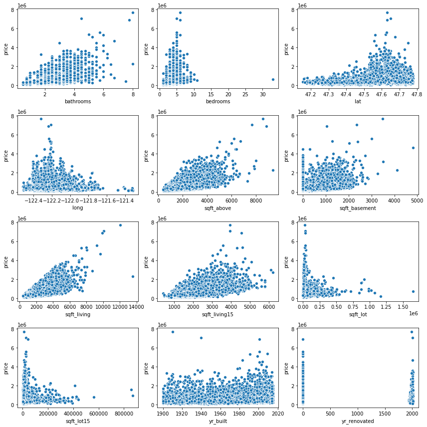

Most variables appear to have at least some linear relationship with price. The exceptions are `sqft_lot` and `sqft_lot15`.  Those appear to extend in two directions.  Since our model already performs reasonably well we will drop them.

`yr_renovated` looks like it has a large gap between 0 and the first non-zero value but then is linear.  This should be fine because any coefficient * 0 will be 0.

## Suspected Categorical Variables

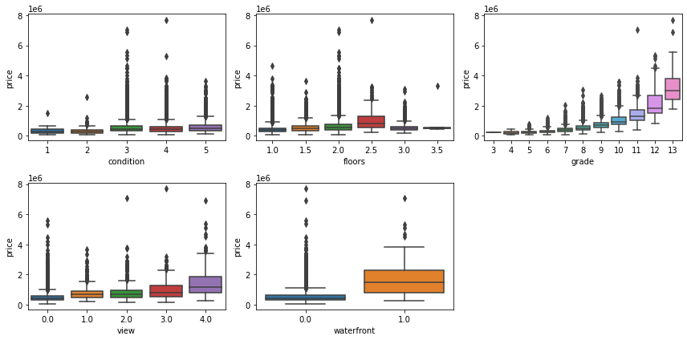

All of the potential categorical values except `zipcode` and `floors` appear to have a linear relationship with price.  Because of that we can treat them as continuous for now.

zipcodes are probably not being used correctly here which we will address later.

## Check for Outliers (DBSCAN)

`sqft_living` seems to have some prominent outliers.  We will use the DBSCAN clustering model to identify the outliers with respect to `sqft_living` and `price`.  The values need to be standardized so they are on the same scale, then run through DBSCAN.  DBSCAN groups values together by proximity.  Values that do not meet the grouping and distance criteria are marked as outliers with a value of -1.  I choose eps by experimentation.

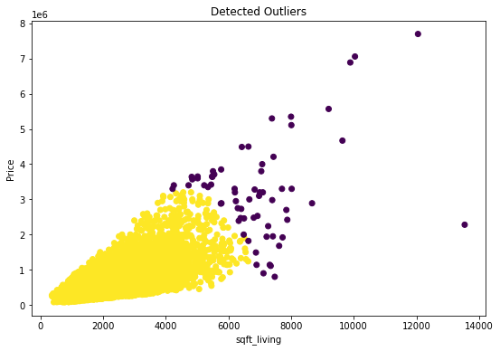

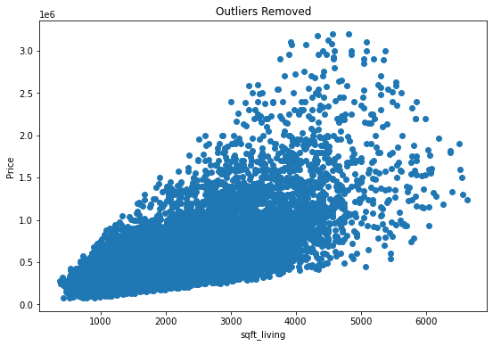

## Create model 2

# Create new features

## Bedrooms

Because bedrooms is probably highly correlated with soft_living, we want to create a new metric which might have more indepedence in our model.  We are goign to create `beds_per_sqft`

### Check interactions of `bedroom` with `sqft_living`

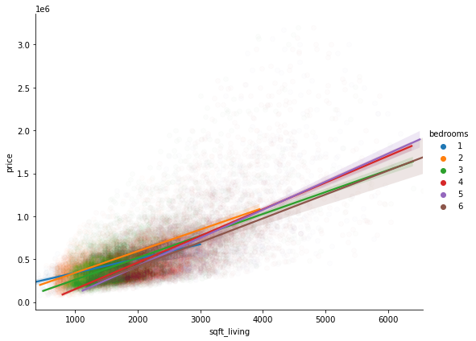

After creating the variable and log transforming it it does have a linear relationship with price.

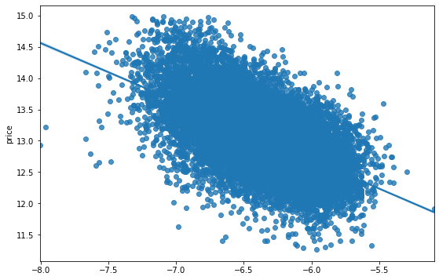

## Then Repeat a similar process for Bathrooms

### Check interactions of bathroom with `sqft_living`

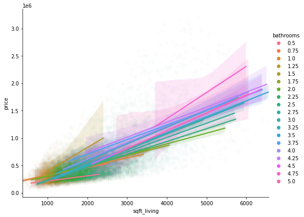

### Check for linearity

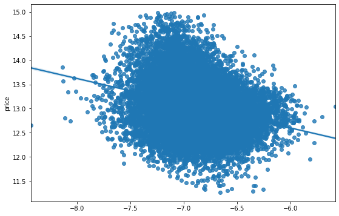

Not as linear as bedrooms but should work fine.

## Create zipcode bins

We want to find a way to use the zipcode information in an easy to explain way for the stakeholder.  We could create dummies for every zipcode but that would be cumbersome.  Here we will try to determine the optimum number of zipcode bins by grouping by median price in each zipcode.

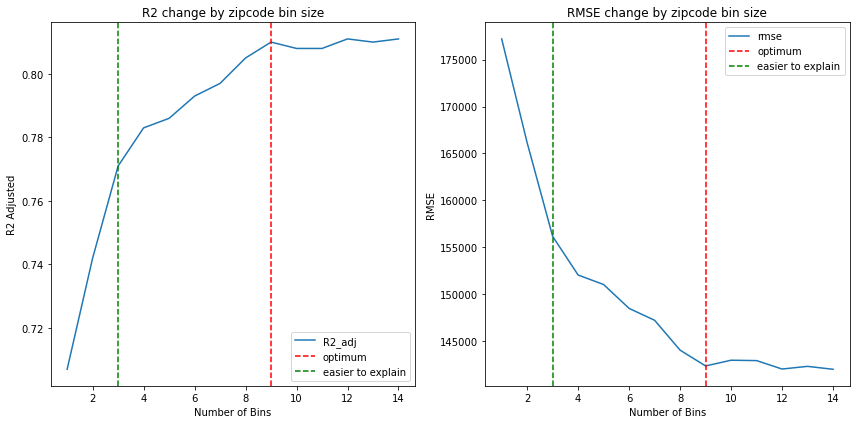

I chose to go with easier to explain and created 3 bins and mapped the resuts.

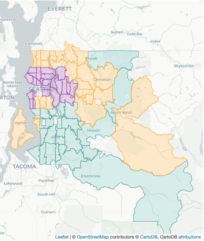

# Correlations

Before dealing with correlations

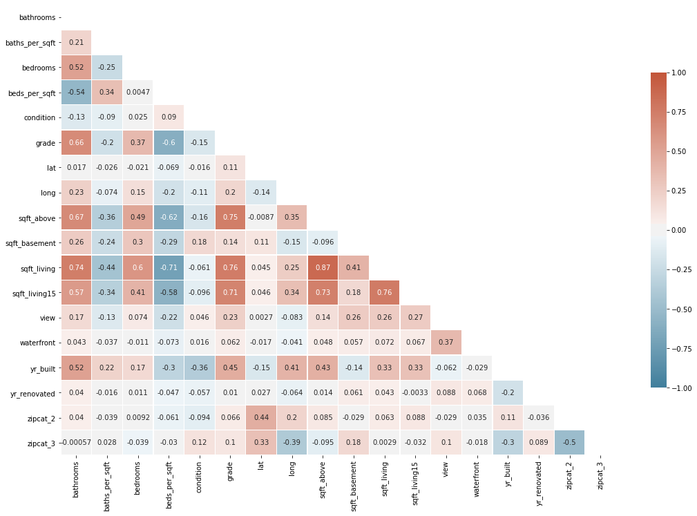

* Dropped high correlations `grade`,`sqft_above`, `sqft_living15`
* checked for interactions between `zipcode_cat` and `sqft_living`

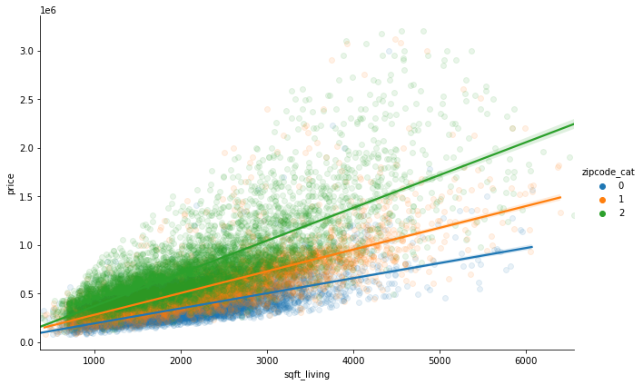

Incorporated this interaction into our model and dropped `sqft_living` The new correlation matrix looks like:

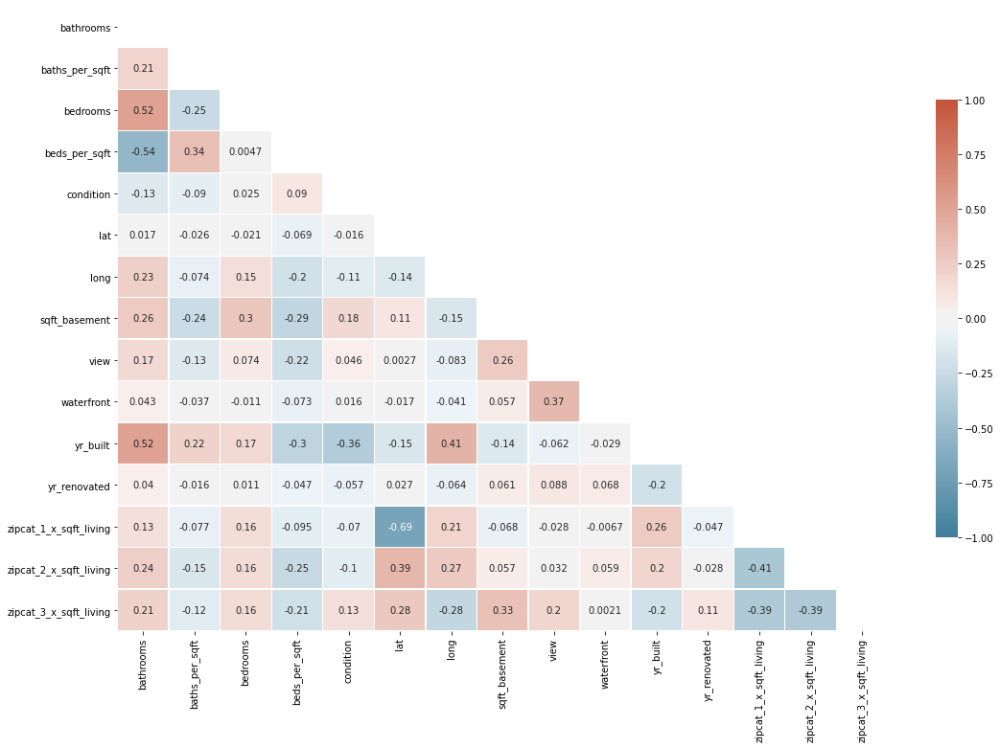

All values are between -0.75 and 0.75

# Multicolinearity

Multicoliniarity was high.

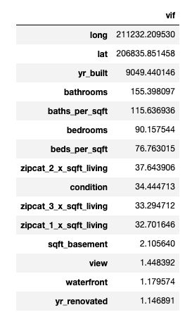

After removing the biggest offenders we found that by removing either `beds_per_sqft` **or** `baths_per_sqft` all vif scores were under 5.  Because of this we decided to use multiple models to answer the questions at hand.

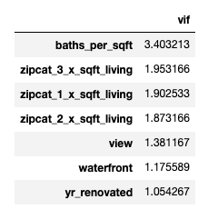

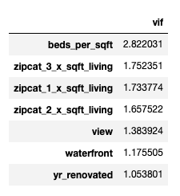


# Model Assumptions

First we visualized the assumptions of normality and homeskedastisity of the residuals

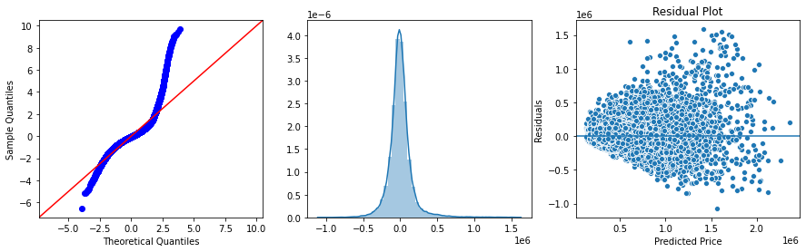

After log transforming both the dependent variable `price` and the all of the sqft independnt variables things started looking much better and were deemed acceptable for this assessment.

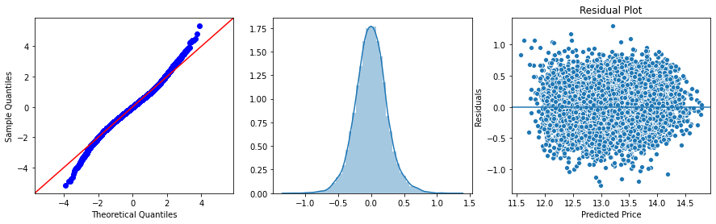

# Interpretation

In the end we have 3 final models.  One to predict home prices and determine the value of adding squarefootage to a house.  Then two other models for predicting the value of adding a bedroom or bathroom to the existing square footage.  These final two models were necessary because of high vifs between them in the first model.  These vifs, however do not effect the sqfootage estimates for which the vif remains low.

## Model 1

* uses both `baths_per_sqft` and  `beds_per_sqft`

* stats:

  ```
  'r2': 0.775,
   'train_rmse': 166788.0,
   'test_rmse': 167158.0
  ```

### Prediction function

Since this model can be used for prediction, create a function to easily take the entered values and transform them to the values the model needs.  The formula does much of this, but not all.  In the future it would be good to write transformation functions for patsy to use when transforming the input variables so they could easily be applied here too.

* Visualise Actual vs Predicted prices

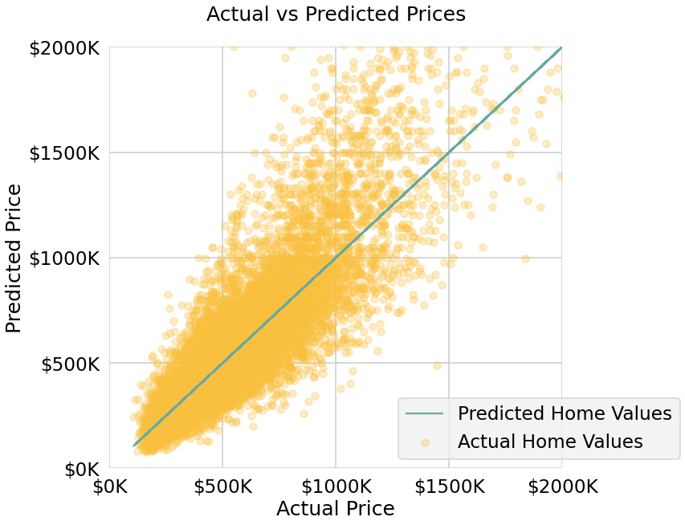

## Interpretation of coefficients

This model can also be used to determine the value of adding square footage to the home.  The coefficient for `sqft_living` has an interaction with zipcode zone.  Because both the dependent and independent variables are log transformed the price after adding square footage to the home can be determined by the following formula:


## Model 2

* uses only `beds_pre_sqft`

* stats:

  ```
  'r2': 0.777,
   'train_rmse': 165853.0,
   'test_rmse': 166231.0
  ```

This model can be used to predict the value of changing the number of bedrooms in the existing footprint of the house.  If more square footage were added additional calculations would be necessary.

The coefficient of the variable `np.log(beds_per_sqft)` is $-0.1374$.

Because both the dependent and independent variable are log transformed we take the proportion of $Beds_2$ to $Beds_1$ to the power of the coefficient.


* Visualize

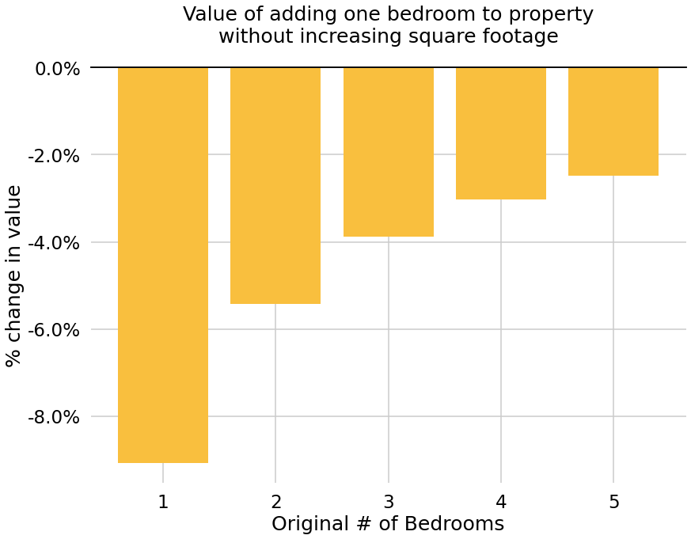


## Model 3

* uses only `baths_pre_sqft`

* stats:

  ```
  'r2': 0.774,
   'train_rmse': 167060.0,
   'test_rmse': 167431.0
  ```

Similar to the model above, this model can be used to understand the value of changing the number of bathrooms in the existing footprint of the house.  If more square footage were added additional calculations would be necessary.

The coefficient of the variable `np.log(baths_per_sqft)` is $0.0470$.

Because both the dependent and independent variable are log transformed we take the proportion of $Baths_2$ to $Baths_1$ to the power of the coefficient.


* visualize

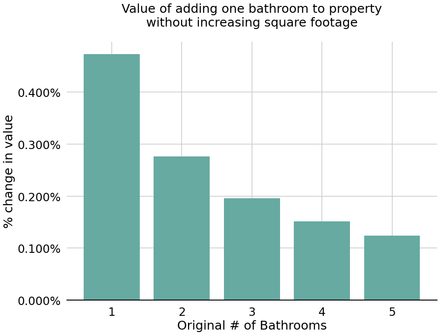

# Final Model List

|                                                      |    r2 | train_rmse | test_rmse | diff_rmse |
| ---------------------------------------------------: | ----: | ---------: | --------: | --------: |
|                                             baseline | 0.700 |   201245.0 |  202880.0 |    1635.0 |
|            1 (nonlinear feature and outlier removal) | 0.702 |   178838.0 |  180363.0 |    1525.0 |
|                           2 (bed/sqft and bath/sqft) | 0.712 |   174544.0 |  175974.0 |    1431.0 |
|                                     3 (zipcode cats) | 0.771 |   155469.0 |  156164.0 |     696.0 |
|                             4 (zip sqft interaction) | 0.779 |   152742.0 |  153048.0 |     306.0 |
|                                 5.1 (baths_per_sqft) | 0.746 |   163766.0 |  164182.0 |     416.0 |
|                                  5.2 (beds_per_sqft) | 0.746 |   163967.0 |  164370.0 |     403.0 |
| Final Model 1: Price prediction and value estimation | 0.775 |   166788.0 |  167158.0 |     370.0 |
|                              Final 2: Bedroom Effect | 0.777 |   165853.0 |  166231.0 |     378.0 |
|                      Final model 3: Bathrooms Effect | 0.774 |   167060.0 |  167431.0 |     370.0 |

# Assessment & Recommendations

* Adding square footage to a property can add significant value to a house.

* Adding bedrooms or bathrooms within the existing square footage is likely to result in a loss.

* The model can be used to predict a price although the model is not terribly accurate.  Still the results can be used for understanding a properties relationship to the market.

The models here focus on isolating factors for accurate coefficients rather than on precise prediction.  For price prediction we would not need to be worried about the accuracy of the coefficients so correlations wouldn't need to be removed.  That would allow us to use more data for a more accurate prediction.

This model will not predict the future.  With only 13 months of data we cannot asses overall market trends or even understand if the monthly trends are specific to this year or can be generalized form year to year.

# Further Work

Other areas to explore in this data for the real estate developer are:

1. **Condition** how does price change with condition rating.
2. **Addition Type** Determine the value of different types of expansions (Bedroom, Bathroom, Other)
3. **Improve the model** With more data, or even just a different focus the prediction quality of the model could be improved dramatically.

# For More Information

Please review our full analysis in our [Jupyter Notebook](notebook.ipynb) or our [Presentation](Presentation.pdf).

For any additional questions, please contact Ben Bogart / [ben@benbogart.com](mailto:ben@benbogart.com)

Repository Structure

```
.
├── notebook.ipynb																	<- the main notebook for the project
├── data																						<- the data the project is based on
├── images																					<- images used throughout the project
├── presentation.pdf																<- a pdf of the presentation slides
└── readme.md																				<- this file
```

